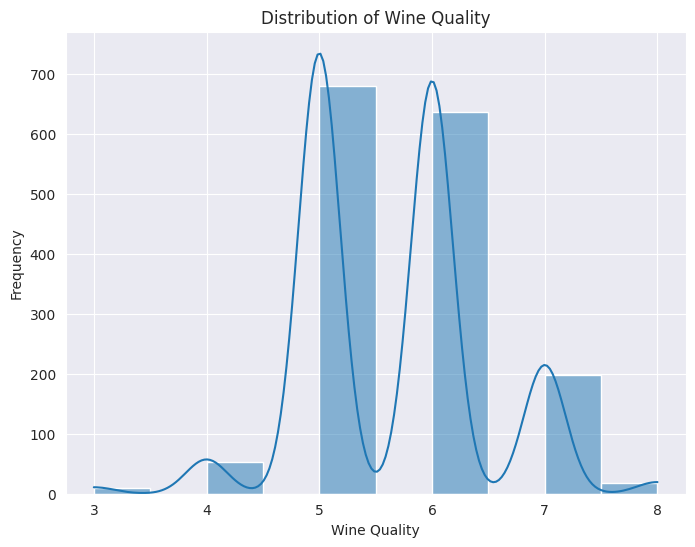
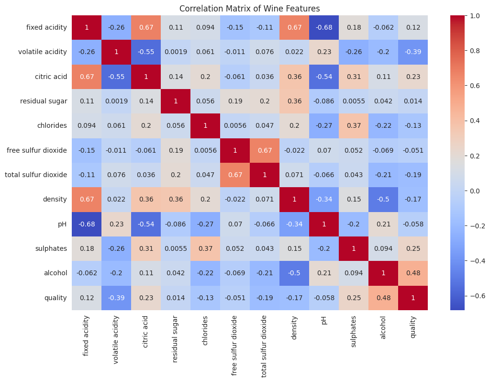
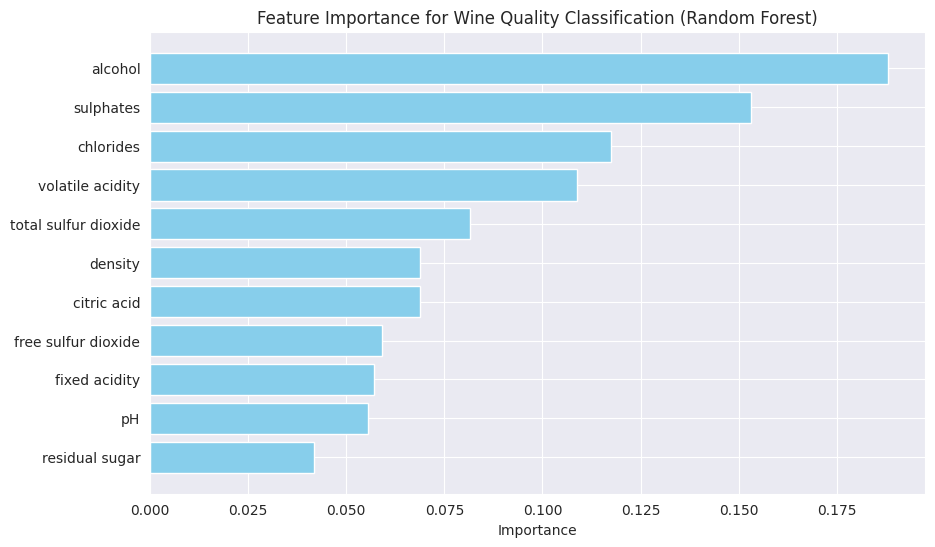
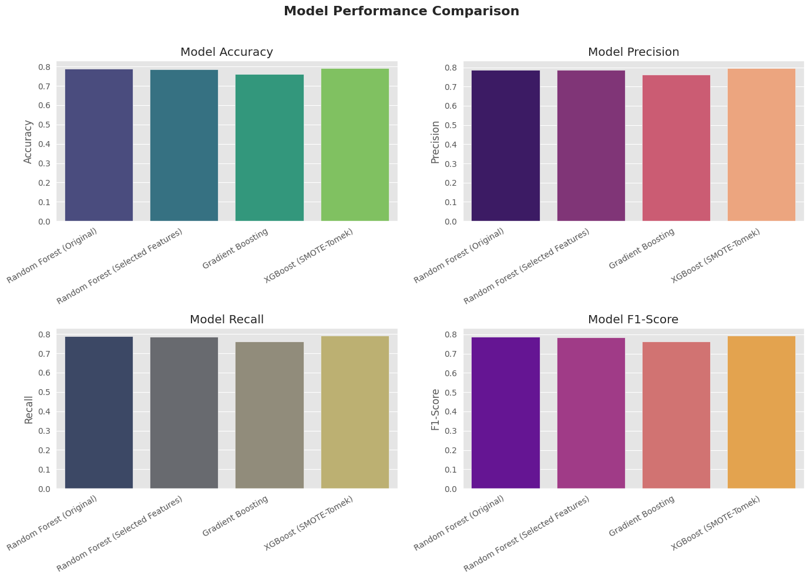

# Sommelier's AI: Predicting Wine Quality with Supervised Learning Models

<br>

**Authorship**  
**Panagiotis S. Georgiadis**, Graduate Student in Computer Science, University of Colorado Boulder.

---
<br>
<br>

**Abstract**  
In this project, I implemented a machine learning pipeline to predict the quality of red wine based on its physicochemical properties using various supervised learning techniques. Through this work, I explored the application of state-of-the-art methods for data preprocessing, feature selection, and model evaluation to develop an accurate predictive model. After experimenting with different algorithms, the XGBoost classifier combined with SMOTE-Tomek oversampling technique demonstrated the best overall performance. This document provides an in-depth analysis of the methodologies applied, the results obtained, and the insights gained.

---
<br>

## Introduction  
My interest in this project was inspired by a personal experience I had while traveling through Greece for about a month. During this trip, I visited over 15 wineries with a close friend who is a major wine distributor in Boston. We tasted a variety of wines and compared their quality to decide which ones to import to the USA. Although I have an extensive knowledge of different wine varietals, their history, and flavor profiles, I found that the subjective nature of wine tasting and scoring could make it difficult for non-experts to evaluate wine quality accurately.

The idea of using machine learning to objectively predict wine quality arose from this experience. By leveraging physicochemical tests and various chemical properties, I sought to develop a model that could accurately classify wine quality and assist both wine enthusiasts and professionals in making informed decisions. This project aims to bridge the gap between subjective wine tasting and objective evaluation by using data-driven methods.

<br>
<br>


## Problem Definition  
The primary objective of this project is to classify wine quality into three categories — **Low**, **Medium**, and **High** — using the chemical properties of the wine as input features. The original dataset, obtained from the UCI Machine Learning Repository, contains 1,599 samples of red wine, each with 11 distinct physicochemical attributes and a quality score ranging from 0 to 10.

### Problem Statement  
Given a set of chemical properties of wine (e.g., acidity, alcohol content, and residual sugar), the goal is to build a machine learning model that can classify wine quality into `Low`, `Medium`, or `High`. This classification problem will be addressed by experimenting with various supervised learning models and optimizing them to achieve high accuracy, precision, recall, and F1-score.

### Target Variable  
- `Quality` (Converted into three classes: `Low`, `Medium`, `High`)

### Features  
- Fixed Acidity
- Volatile Acidity
- Citric Acid
- Residual Sugar
- Chlorides
- Free Sulfur Dioxide
- Total Sulfur Dioxide
- Density
- pH
- Sulphates
- Alcohol
  

<br>
<br>

## Dataset and Exploratory Data Analysis (EDA)
<br>

### Dataset
```
    fixed acidity  volatile acidity  citric acid  residual sugar  chlorides  
0            7.4              0.70         0.00             1.9      0.076   
1            7.8              0.88         0.00             2.6      0.098   
2            7.8              0.76         0.04             2.3      0.092   
3           11.2              0.28         0.56             1.9      0.075   
4            7.4              0.70         0.00             1.9      0.076   

   free sulfur dioxide  total sulfur dioxide  density    pH  sulphates  
0                 11.0                  34.0   0.9978  3.51       0.56   
1                 25.0                  67.0   0.9968  3.20       0.68   
2                 15.0                  54.0   0.9970  3.26       0.65   
3                 17.0                  60.0   0.9980  3.16       0.58   
4                 11.0                  34.0   0.9978  3.51       0.56   

   alcohol  quality  
0      9.4        5  
1      9.8        5  
2      9.8        5  
3      9.8        6  
4      9.4        5  
```
  
  <br>

### Data Description Example
```
        fixed acidity  volatile acidity  citric acid  residual sugar 
count    1599.000000       1599.000000  1599.000000     1599.000000   
mean        8.319637          0.527821     0.270976        2.538806   
std         1.741096          0.179060     0.194801        1.409928   
min         4.600000          0.120000     0.000000        0.900000   
25%         7.100000          0.390000     0.090000        1.900000   
50%         7.900000          0.520000     0.260000        2.200000   
75%         9.200000          0.640000     0.420000        2.600000   
max        15.900000          1.580000     1.000000       15.500000   
```

<br>
<br>
<br>

### Data Visualizations





---

## Methodology  
### Data Preprocessing  
The dataset was first preprocessed to handle missing values and ensure data consistency. This involved:
 
1. **Check for missing values in the dataset**:
   ```
   fixed acidity           0  
   volatile acidity        0  
   citric acid             0  
   residual sugar          0  
   chlorides               0  
   free sulfur dioxide     0  
   total sulfur dioxide    0  
   density                 0  
   pH                      0  
   sulphates               0  
   alcohol                 0  
   quality                 0  
   ```

2. **Converting the Target Variable**:  
   - The `quality` variable was transformed into a categorical variable with three classes: `Low` (quality ≤ 5), `Medium` (5 < quality ≤ 7), and `High` (quality > 7).
   - This transformation enables us to treat the problem as a classification task rather than a regression problem.

   ```python
   # Pseudocode for target variable transformation
   data['quality_label'] = data['quality'].apply(lambda x: 'Low' if x <= 5 else ('Medium' if x <= 7 else 'High'))
   ```

3. **Standardizing the Features**:  
   - To ensure that all features contribute equally to the model, numerical features were standardized using `StandardScaler`. This step is crucial for models that are sensitive to feature scaling, such as Logistic Regression and Gradient Boosting.

   ```python
   # Pseudocode for feature scaling
   scaler = StandardScaler()
   X_scaled = scaler.fit_transform(X)
   ```

4. **Handling Class Imbalance**:  
   - The dataset exhibited a severe class imbalance, with most samples belonging to the `Medium` class and very few in the `High` class.
   - This issue was addressed using two resampling techniques:
     - **SMOTE (Synthetic Minority Over-sampling Technique)**: Generated synthetic samples to balance the minority class.
     - **SMOTE-Tomek**: A combination of SMOTE and Tomek links was used to create a balanced dataset while also reducing class overlap by removing noisy samples.

   ```python
   # Pseudocode for applying SMOTE and SMOTE-Tomek
   smote = SMOTE(random_state=42)
   X_train_smote, y_train_smote = smote.fit_resample(X_train, y_train)
   
   smote_tomek = SMOTETomek(random_state=42)
   X_train_smote_tomek, y_train_smote_tomek = smote_tomek.fit_resample(X_train, y_train)
   ```
   - The initial class distribution was highly imbalanced, with the majority of wines labeled as "Medium" quality and very few labeled as "High" quality. This was addressed using Synthetic Minority Over-sampling Technique (SMOTE) and SMOTE-Tomek.

   ```
   Class distribution before SMOTE:  
   Medium    663  
   Low       603  
   High       13  
   
   Class distribution after SMOTE:  
   Medium    663  
   Low       663  
   High      663  
   
   Class distribution after SMOTE-Tomek:  
   High      663  
   Medium    621  
   Low       621  
   ```
### Model Training and Evaluation  
Several supervised learning models were applied, and their performances were compared using various evaluation metrics such as accuracy, precision, recall, and F1-score.

1. **Random Forest Classifier**:  
   - An ensemble model that uses multiple decision trees to improve prediction accuracy and reduce overfitting.
   - The Random Forest model was first trained using the balanced dataset created by SMOTE. It achieved an accuracy of approximately 78.7%, demonstrating robust performance in predicting the `Medium` and `Low` quality classes.

   ```python
   # Pseudocode for training Random Forest model
   rf_classifier = RandomForestClassifier(random_state=42, class_weight='balanced')
   rf_classifier.fit(X_train_smote, y_train_smote)
   ```
   **Performance Metrics:**
   ```
   Accuracy: 0.7875  
   Precision: 0.785446716357776  
   Recall: 0.7875  
   F1-Score: 0.7863080888906897  
   Confusion Matrix:  
   [[  0   0   5]  
    [  0 114  27]  
    [  4  32 138]]
   ```

2. **Logistic Regression**:  
   - A linear model used as a baseline classifier.
   - Logistic Regression had a lower accuracy of around 61.5%, serving as a reference for more complex models.

   ```python
   # Pseudocode for training Logistic Regression model
   lr_classifier = LogisticRegression(random_state=42, class_weight='balanced', max_iter=1000)
   lr_classifier.fit(X_train_smote, y_train_smote)
   ```
   **Performance Metrics:**
   ```
   Accuracy: 0.615625  
   Precision: 0.7213290111137989  
   Recall: 0.615625  
   F1-Score: 0.6411491135015758  
   Confusion Matrix:  
   [[  5   0   0]  
    [  7 110  24]  
    [ 40  52  82]]
   ```

3. **Feature Selection Using Recursive Feature Elimination (RFE)**:  
   - RFE was used with Logistic Regression as the base model to select the top 5 features that contributed the most to the classification task.
   - A new Random Forest model was then trained using these selected features, achieving an accuracy of 78.4%, which was comparable to the performance of the original Random Forest.

   ```python
   # Pseudocode for Recursive Feature Elimination (RFE)
   rfe = RFE(estimator=LogisticRegression(random_state=42, class_weight='balanced'), n_features_to_select=5)
   rfe.fit(X_train_smote, y_train_smote)
   selected_features = X.columns[rfe.support_]
   ```
   
4. **Gradient Boosting Classifier**:  
   - An ensemble technique that builds decision trees sequentially, with each tree correcting the errors of the previous ones.
   - After hyperparameter tuning using GridSearchCV, the best Gradient Boosting model achieved an accuracy of 76.2%.

   ```python
   # Pseudocode for training Gradient Boosting model with hyperparameter tuning
   param_grid = {'n_estimators': [50, 100, 200], 'learning_rate': [0.01, 0.1, 0.2], 'max_depth': [3, 5, 7]}
   gb_classifier = GradientBoostingClassifier(random_state=42)
   grid_search = GridSearchCV(estimator=gb_classifier, param_grid=param_grid, cv=5, scoring='accuracy', n_jobs=-1)
   grid_search.fit(X_train_smote_tomek, y_train_smote_tomek)
   ```

5. **XGBoost Classifier**:  
   - XGBoost, a highly efficient and scalable implementation of gradient boosting, was used as the final model.
   - After fine-tuning, the XGBoost model combined with SMOTE-Tomek obtained the highest accuracy of 79.0%. This model demonstrated the best balance between all evaluation metrics and was able to handle the class imbalance effectively.

   ```python
   # Pseudocode for training XGBoost model
   xgb_classifier = XGBClassifier(objective='multi:softmax', eval_metric='mlogloss', random_state=42)
   grid_search_xgb = GridSearchCV(estimator=xgb_classifier, param_grid=param_grid, cv=5, scoring='accuracy', n_jobs=-1)
   grid_search_xgb.fit(X_train_smote_tomek, y_train_smote_tomek_encoded)
   ```
   **Performance Metrics:**
   ```
   Accuracy: 0.790625  
   Precision: 0.7947610445912469  
   Recall: 0.790625  
   F1-Score: 0.7926105251845167  
   Confusion Matrix:  
   [[  1   0   4]  
    [  0 112  29]  
    [  6  28 140]]
   ```
   
---

## Results and Analysis  
The results from all models were compared using a set of evaluation metrics. The following table summarizes the performance of each model:

| Model                               | Accuracy | Precision | Recall | F1-Score |
|-------------------------------------|----------|-----------|--------|----------|
| Random Forest (Original)            | 78.75%   | 78.54%    | 78.75% | 78.63%   |
| Random Forest (Selected Features)   | 78.44%   | 78.58%    | 78.44% | 78.45%   |
| Gradient Boosting                   | 76.25%   | 76.26%    | 76.25% | 76.25%   |
| XGBoost (SMOTE-Tomek)               | 79.06%   | 79.48%    | 79.06% | 79.26%   |



---

## Conclusion  
The project successfully demonstrated the application of various supervised learning models to predict wine quality based on its chemical properties. The use of resampling techniques such as SMOTE and SMOTE

-Tomek helped overcome class imbalance issues, resulting in improved model performance. The XGBoost classifier emerged as the best-performing model, with the highest accuracy, precision, recall, and F1-score.

Through this project, I gained hands-on experience in handling class imbalance, implementing feature selection, and tuning hyperparameters. The project not only enhanced my understanding of supervised learning algorithms but also provided insights into the practical challenges of building robust machine learning models for real-world data.

## Future Work  
For future iterations of this project, I would explore additional feature engineering techniques and experiment with deep learning models to further enhance prediction accuracy. Additionally, deploying this model in a web application could enable real-time predictions for new wine samples.

---
### About Me
I am a graduate student specializing in computer science, with a particular interest in cloud engineering and machine learning. I have a passion for applying cutting-edge machine learning techniques to solve real-world problems. This project on wine quality prediction stems from my personal experience and extensive research in this field. I have combined my knowledge of data science with my personal understanding of wine varietals to develop a machine learning model that bridges the gap between subjective tasting experiences and objective evaluation using physicochemical properties.

---
**Keywords**: Supervised Learning, Wine Quality Prediction, XGBoost, Random Forest, Logistic Regression, Gradient Boosting, SMOTE, Feature Selection, Machine Learning, Classification.

---